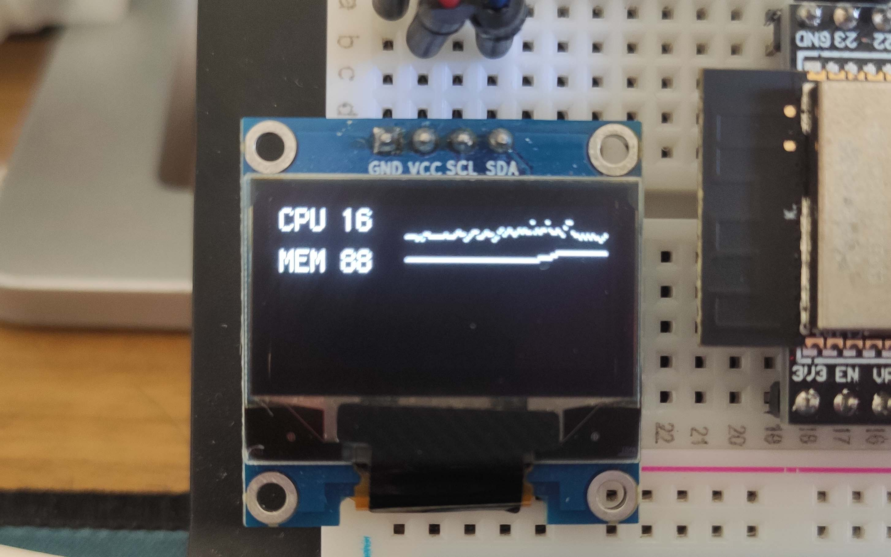

## cpu-ram-meter 项目

cpu-ram-meter 是一个电脑硬件资源仪表盘项目，用来监控PC上的硬件资源使用情况，比如CPU使用率和内存使用率。

下位机硬件部分使用一块ESP8266/ESP32开发板，和一块12864 OLED模块组成，无需更多额外硬件。软件部分使用Arduino软件编写。

上位机部分使用Python 3.10语言。和下位机之间使用TCP协议进行通信。

## 项目特点

1. 建立连接后，图形绘制工作由上位机Python完成，并将缓冲区发送给下位机进行显示。以方便对显示内容仅需修改和调试。同时无需修改下位机的C代码，省去了搭建开发环境的麻烦
2. 支持屏幕亮度调节，亮度值会被持久化，每次上电会自动读取上次的值
3. 支持通过串口配置WIFI名称和密码，而非写死在程序里。更换WiFi环境仅需使用串口重新配置即可，无需搭建完整的编译环境和修改代码

## 资源引用说明

上位机文字绘制所使用的字体为：[方舟像素字体 - 开源的泛中日韩像素字体 / Ark pixel font - Open source Pan-CJK pixel font](https://github.com/TakWolf/ark-pixel-font)